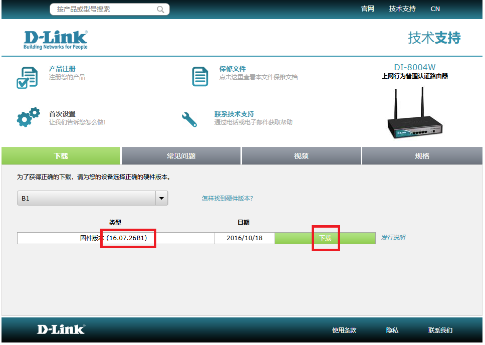
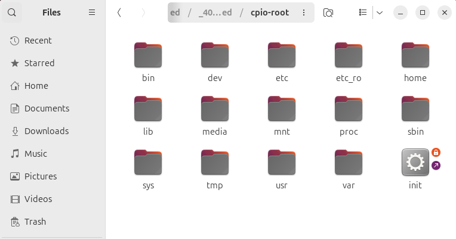
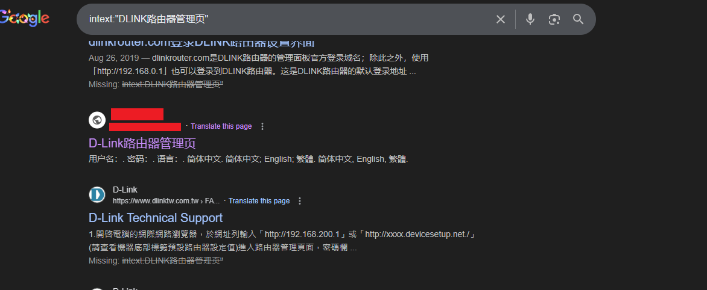
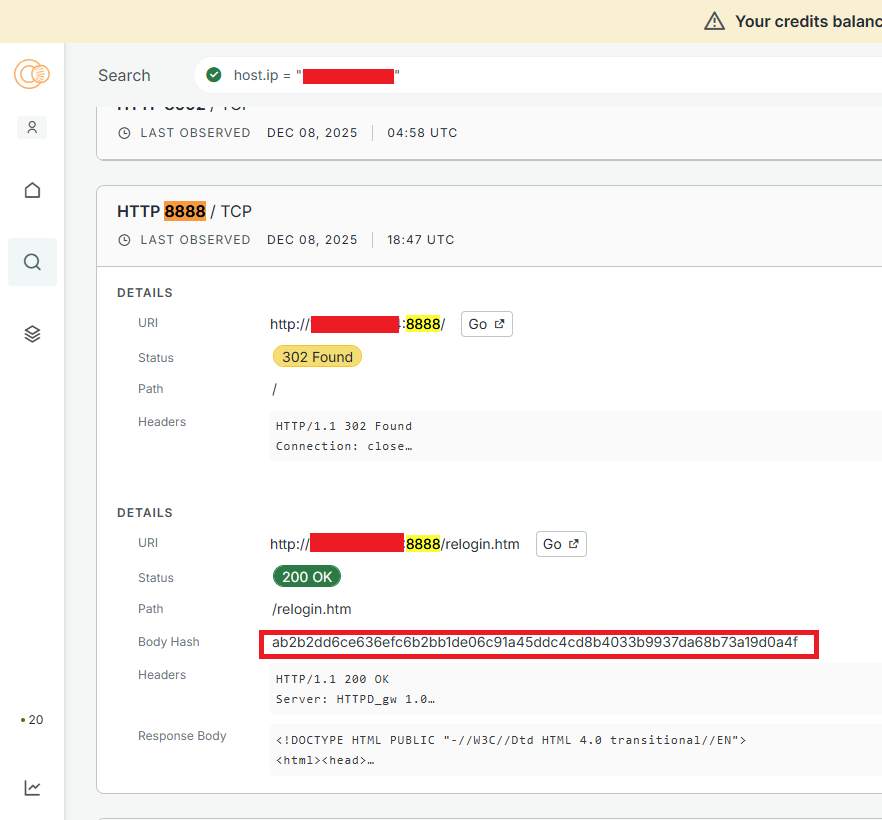
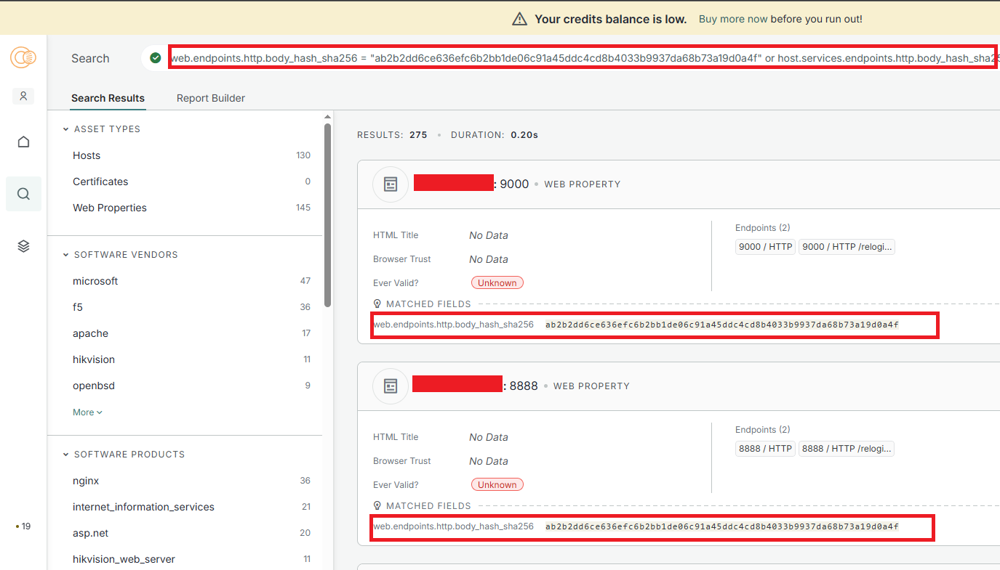

# DLink DI-7100G
{: .no_toc }

## Table of contents
{: .no_toc .text-delta }

1. TOC
{:toc}

---

### Overview
First found the official site for firmware [download](https://www.dlink.com.cn/techsupport/ProductInfo.aspx?m=DI-8004W), the donwloaded file has <b>.trx</b> extension<br>
```
eric@eric-VMware-Virtual-Platform:~/Desktop$ binwalk -Me DI_8004W-16.07.26A1.trx
```


SquashFS root filesystem found in following path. Most of the folder seems to be empty, could not find relavent web hosting files. 
```
_8C.extracted/
└── _404000.extracted
    └── cpio-root
```


Run string command to find relavent http strings within the squash filesystem
```
eric@eric-VMware-Virtual-Platform:~/Desktop/_DI_8004W-16.07.26A1.trx.extracted/_8C.extracted/_404000.extracted$ grep -R -n -i "<html" cpio-root/
grep: cpio-root/lib/libupnp.so.1.3.1: binary file matches
grep: cpio-root/bin/wscd: binary file matches
grep: cpio-root/usr/sbin/jhttpd: binary file matches
```

Run grep for html tag "title" within jhttpd
```
grep -Rni "<title>" _jhttpd.extracted/
...
grep: _jhttpd.extracted/menu_3_3.html: binary file matches
_jhttpd.extracted/login.html:4:<title>D-link</title>
grep: _jhttpd.extracted/menu_0_7.html: binary file matches
grep: _jhttpd.extracted/menu_0_5.html: binary file matches
grep: _jhttpd.extracted/thdlist.htm: binary file matches
...
```

Inspect index.html found the following http content. the page uses gb2312 encoding.
```
...
<html>
<head>
<meta http-equiv="Content-Type" content="text/html; charset=gb2312" />
<meta http-equiv="X-UA-Compatible" content="IE=EmulateIE7" />
<title>DLINK路由器管理页</title>
...
```

Search the unqiue pattern "DLINK路由器管理页" to find open server with google dork searching


Search the found IP with search engine (censys for example). found body hash. use the body hash as filter to find more online devices with same hash. 



