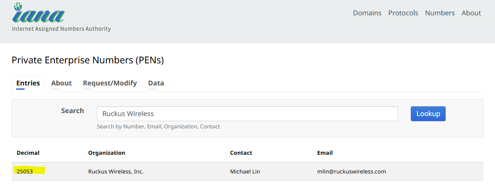
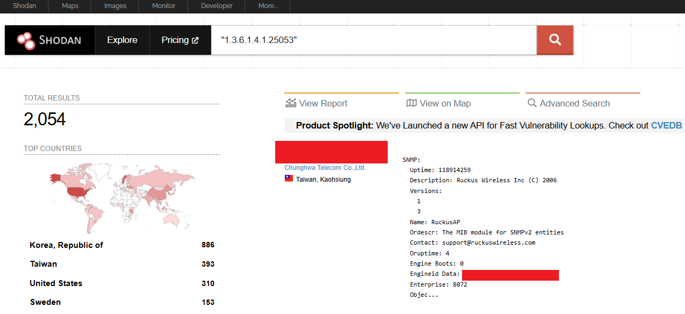
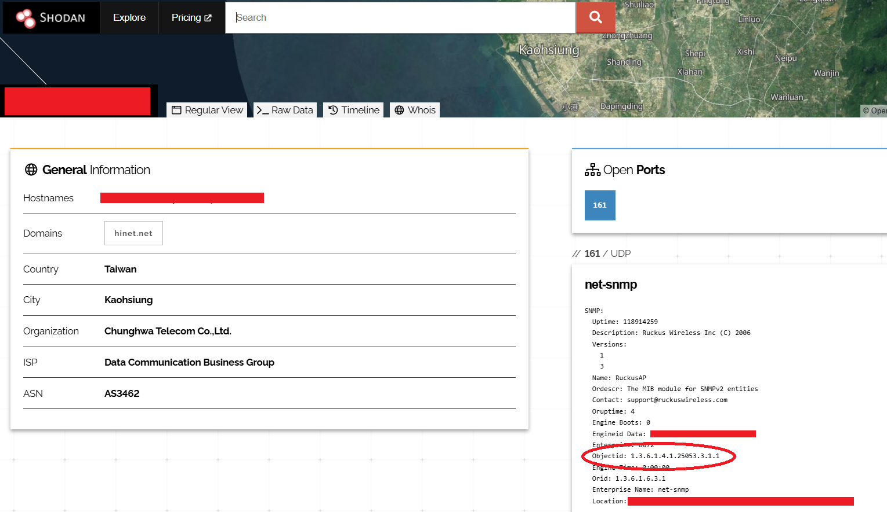
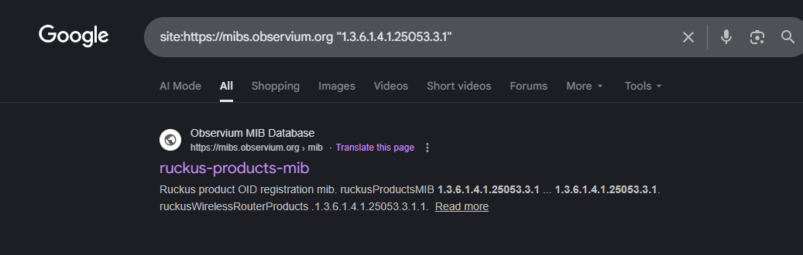
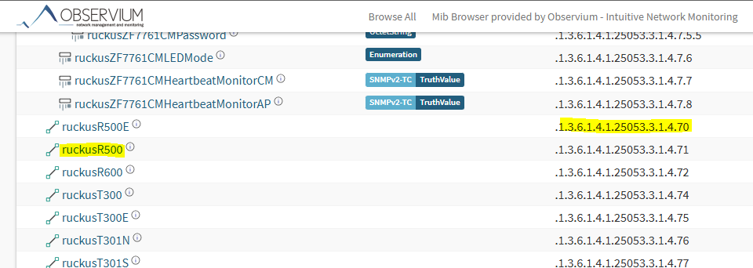
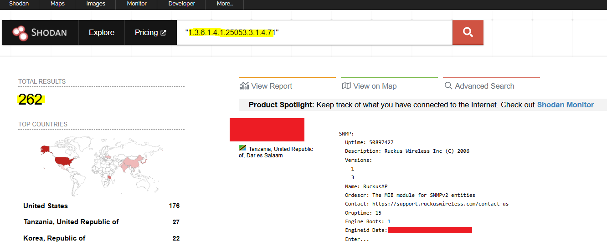

# Ruckus R500
{: .no_toc }

## Table of contents
{: .no_toc .text-delta }

1. TOC
{:toc}

---

### Overview
Network devices such as router and access point often have snmp capability. search Private Enterprise Numbers (PENs) associate with Ruckus


search on shodan with the following filter
```
"1.3.6.1.4.1.25053"
```



Found objectid 1.3.6.1.4.1.25053.3.1.1. The last node could be product/model specific. <br>
search online repository for mib with OID "1.3.6.1.4.1.25053.3.1" to find relavent mib file. Could use the following filter to search from specific repository.
```
site:https://mibs.observium.org "1.3.6.1.4.1.25053.3.1"
```


Found the Object ID for R500 is "1.3.6.1.4.1.25053.3.1.4.71"<br>


Search on shodan/Censys to expand from there



