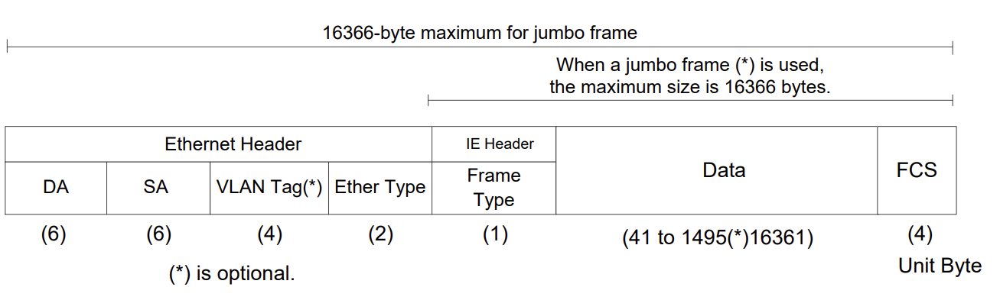
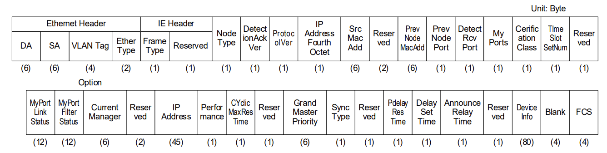

# CC-Link IE TSN
{: .no_toc }

## Table of contents
{: .no_toc .text-delta }

1. TOC
{:toc}

---

### Overview
CC-Link IE TSN is an open industrial Ethernet protocol that uses Time-Sensitive Networking (TSN) for high-speed, deterministic communication. It supports real-time and non-real-time data exchange with precise time synchronization, enabling interoperability across devices from different vendors.

### Basic Structure

CC-Link IE TSN frame configuration<br>


DetectionAck Ver.1 frame configuration<br>


### Frame Type
- Priority (0xC0)
- Detection (0xC1)
- DetectionAck (0xC2)
- AcyclicData (0xC3)
- Cyclic M/MS (0xC4)
- Cyclic S/Ss (0xC5)
- TestDataAck (0x12)
- TestData (0x11)

### Sample Hex Dump (DetectionAck)

```
0000   c2 00 01 01 20 01 58 52 8a XX XX XX 00 00 28 e9   .... .XR......(.
0010   8e XX XX XX 01 01 02 00 00 00 03 00 00 00 00 00   .-u.............
0020   00 00 00 00 00 00 11 00 00 00 00 00 00 00 00 00   ................
0030   00 00 28 e9 8e XX XX XX 00 00 c0 a8 03 01 ff ff   ..(..-u.........
0040   ff 00 00 00 00 00 00 00 00 00 00 00 00 00 00 00   ................
0050   00 00 00 00 00 00 00 00 00 00 00 00 00 00 00 00   ................
0060   00 00 00 00 00 00 00 03 09 00 ff ff ff ff ff ff   ................
0070   00 00 00 00 00 00 00 01 00 00 5f ff 08 94 00 00   .........._.....
0080   00 03 00 07 30 20 00 00 00 40 00 00 00 00 00 06   ....0 ...@......
0090   f8 00 00 00 00 30 00 00 00 00 00 00 02 60 00 04   .....0.......`..
00a0   00 08 00 00 00 04 00 08 00 00 00 08 00 00 22 00   ..............".
00b0   00 00 00 00 00 00 d0 01 08 00 00 00 00 00 28 e9   ..............(.
00c0   8e XX XX XX 01 00 00 00 00 00                     .-u.......
```

```
CC-Link IE TSN [acyclicDetectionHeader]
    frameType       : DetectionAck (0xc2)
    reserved        : 0x00
CC-Link IE TSN [acyclicDetectionAckData]
    nodeType             : 0x01
    protocolVer          : 0x01
    reserved1            : 0x20
    ipAddressFourthOctet : 1 (0x01)
    srcMAC               : 58:52:8a:XX:XX:XX
    reserved2            : 0x0000
    previousNodeMAC      : 28:e9:8e:XX:XX:XX
    previousNodePort     : 0x01
    detectionRcvPort     : 0x01
    myPort               : 0x02
    certificationClass   : ccieTsnClassA (0x00)
    reserved3            : 0x0000
    myPortLinkStatus
    myPortFilterStatus
    currentManager       : 28:e9:8e:XX:XX:XX
    reserved4            : 0x0000
    ipAdd
    performance          : 0x03
    reserved5            : 0x0900
    gmPriority
    syncType             : 0x00
    reserved6            : 0x00
    pdelayResTime        : 0x00
    delaySetTime         : 0x00
    announceRelayTime    : 0x00
    reserved7            : 0x00
    deviceVer            : 0x0001
    vendorCode           : 0x0000
    modelCode            : 0x5fff0894
    expansionmodelCode   : 0x0000
    deviceType           : 0x0003
    memoryAddress
    cyclicSize
    reserved8            : 0x0000
    function             : 0x22
    optionInfo           : 0x00
    stationSubIdNumber   : 0x0000
    resreved9            : 0x0000
    stationMode          : 0x0000
    function2            : 0xd0
    resreved10           : 0x010800
    syncAccuracy         : 0x00000000
    dtctMaking Node MAC  : 28:e9:8e:XX:XX:XX
    dtctMaking Node Port : 0x01
    resreved11           : 0x00
    blank                : 0x00000000
```

### Reference
[Networks- Enabling Wireshark to Read CCIEF Basic / TSN / SLMP packages](https://www.fasupportme.com/portal/en/kb/articles/enabling-wireshark-to-read-ccief-basic-tsn-slmp-packages)<br>
[NZ2GN2S1-32DT CSP+ files for CC-Link IE TSN Remote IO](https://emea.mitsubishielectric.com/fa/get-asset?asset=https%3A%2F%2Feu-assets.contentstack.com%2Fv3%2Fassets%2Fblt5412ff9af9aef77f%2Fblt88bfc7e486c6e9e2%2F61f6735875df5636a03fd19b%2F0eb9e714-511c-11ec-9e07-b8ca3a62a094_zipped-csp_cciet_remoteio_en.zip)<br>
[CC-Link IE TSN Specifications](https://in.cc-link.org/en/downloads/index.html)<br>
[BAP-C2011ENG-004-J]()