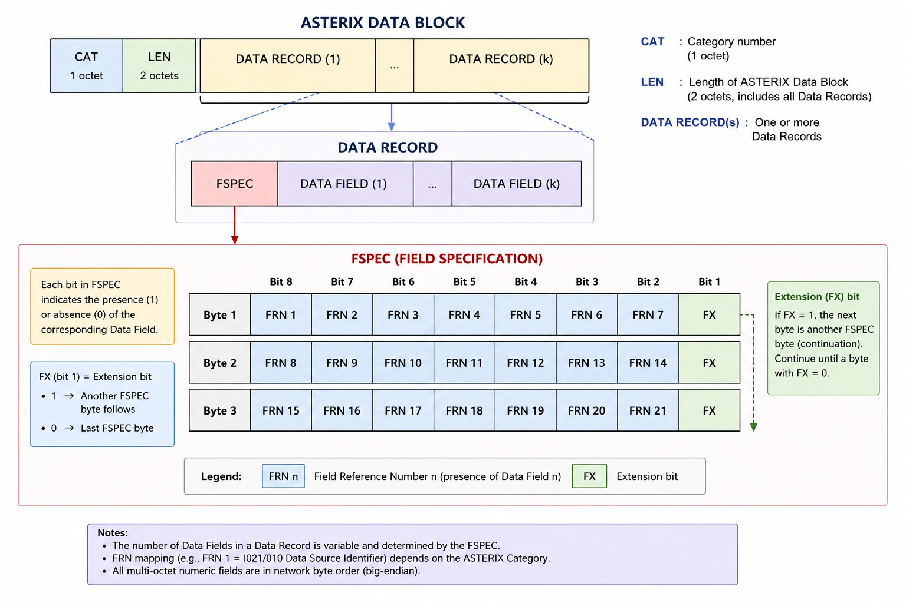
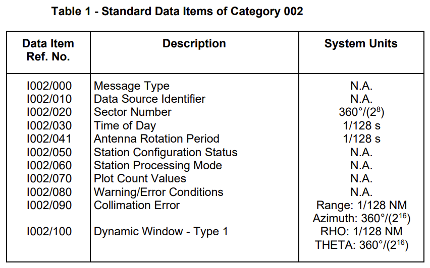

# ASTERIX
{: .no_toc }

## Table of contents
{: .no_toc .text-delta }

1. TOC
{:toc}

---

### Overview
ASTERIX (All Purpose Structured EUROCONTROL Surveillance Information EXchange) is a standardized data format developed by EUROCONTROL for exchanging surveillance and related information between air traffic management systems. It operates primarily over network protocols such as UDP and TCP, with UDP commonly used for real-time surveillance data. ASTERIX defines multiple standardized categories (CAT), such as CAT001, CAT002, CAT021, and CAT048, covering different types of surveillance and aeronautical information. It enables interoperability between radar, ADS-B, multilateration, and other surveillance systems without relying on proprietary data formats.

Port 8600 is registered with IANA for ASTERIX, although the ASTERIX specification does not mandate a specific UDP port. ASTERIX data is commonly transported over UDP, including local multicast. The specific multicast address and UDP port remain implementation-dependent.

### Protocol Strucutre / Field Type


IPv4 Multicast Address Space ([more](https://www.iana.org/assignments/multicast-addresses))

| Address Space  | Name                        | Description                                                                                                          |
| -------------- | --------------------------- | -------------------------------------------------------------------------------------------------------------------- |
| `224.0.0.0/24` | Local Network Control Block | Used for local network control traffic. Multicast traffic in this range is generally restricted to the local subnet. |
| `239.0.0.0/8`  | Administratively Scoped     | Used for administratively scoped multicast traffic, typically within private/local networks.                         |

### Item Type
Item Type identifies the specific type of information contained within a Data Field, such as aircraft identification, position, altitude, or other surveillance data. Each item type defines how its corresponding data is structured and interpreted. Below is an example for CAT002 Item Type [Category 002 Specification](https://www.eurocontrol.int/sites/default/files/2024-03/cat002-asterix-monoradar-service-messages-part2b-042021-1-2.pdf)

CAT002 Item type


### Example Hexdump
```
0000   22 00 10 f4 93 19 02 37 8d 57 20 94 00 20 20 00   "......7.W ..  .

ASTERIX packet, Category 034
    Category: 34
    Length: 16
    Asterix message, #01, length: 13
        FSPEC
        010, Data Source Identifier
        000, Message Type
        030, Time of Day
        020, Sector Number
        050, System Configuration and Status
```

### Reference 
[ASTERIX Wireshark Dissector Github](https://gitlab.com/wireshark/wireshark/-/blob/master/epan/dissectors/packet-asterix.c)<br>
[EUROCONTROL Specification for Surveillance Data Exchange Part I](https://www.eurocontrol.int/publication/eurocontrol-specification-surveillance-data-exchange-part-i)<br>