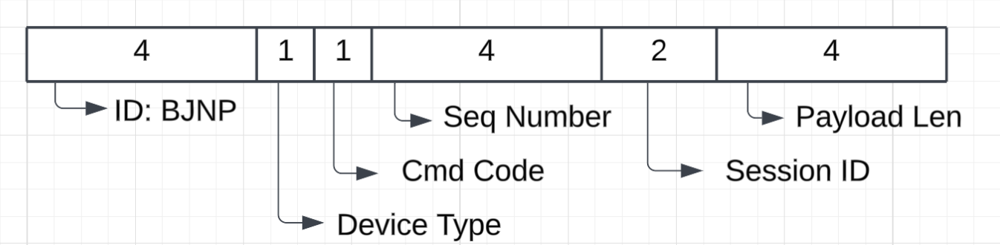
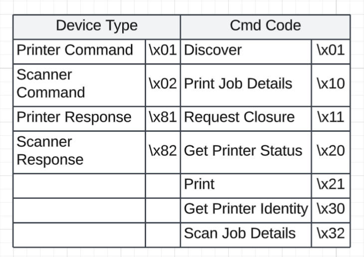

# BJNP
{: .no_toc }

## Table of contents
{: .no_toc .text-delta }

1. TOC
{:toc}

---

### Overview
Canon BJNP is a proprietary network printing protocol developed by Canon for communication between Canon printers and computers or mobile devices over a network. It operates over TCP and UDP, typically using port 8611 for scanning, 8612 for printing, and 8613 for device discovery. BJNP facilitates discovery, printing, and scanning functions, enabling Canon printers to work seamlessly over LAN or wireless connections without standard IPP or LPD protocols. It's primarily used in consumer-grade Canon multifunction printers.

### Protocol Strucutre / Field Type



### Discovery Request / Response
```
echo -n 'BJNP\x01\x30\x00\x00\x00\x01\x00\x00\x00\x00\x00\x00' | netcat -u XXX.XXX.XXX.XXX 8611
```
```
# Reqeust
0000   42 4a 4e 50 01 30 00 00 00 01 00 00 00 00 00 00   BJNP.0..........
```
```
# Response
0000   42 4a 4e 50 81 30 00 00 00 01 00 00 00 00 00 f2   BJNP.0..........
0010   00 f2 4d 46 47 3a 43 61 6e 6f 6e 3b 43 4d 44 3a   ..MFG:Canon;CMD:
0020   42 4a 4c 2c 42 4a 52 61 73 74 65 72 33 2c 42 53   BJL,BJRaster3,BS
0030   43 43 65 2c 4e 43 43 65 2c 49 56 45 43 2c 49 56   CCe,NCCe,IVEC,IV
0040   45 43 50 4c 49 3b 53 4f 4a 3a 42 4a 4e 50 32 2c   ECPLI;SOJ:BJNP2,
0050   42 4a 4e 50 65 3b 4d 44 4c 3a 4d 47 35 35 30 30   BJNPe;MDL:MG5500
0060   20 73 65 72 69 65 73 3b 43 4c 53 3a 50 52 49 4e    series;CLS:PRIN
0070   54 45 52 3b 44 45 53 3a 43 61 6e 6f 6e 20 4d 47   TER;DES:Canon MG
0080   35 35 30 30 20 73 65 72 69 65 73 3b 56 45 52 3a   5500 series;VER:
0090   33 2e 30 39 30 3b 53 54 41 3a 31 30 3b 46 53 49   3.090;STA:10;FSI
00a0   3a 30 30 3b 48 52 49 3a 32 3b 4d 53 49 3a 41 4f   :00;HRI:2;MSI:AO
00b0   46 46 2c 42 32 34 30 2c 44 41 54 2c 45 33 2c 48   FF,B240,DAT,E3,H
00c0   46 53 46 2c 4a 4f 46 46 2c 4b 32 31 30 30 30 37   FSF,JOFF,K210007
00d0   30 30 2c 4c 4f 46 46 3b 50 44 52 3a 33 3b 50 53   00,LOFF;PDR:3;PS
00e0   45 3a XX XX XX XX XX XX XX XX XX 3b 43 49 44 3a   E:XXXXXXXXX;CID:
00f0   43 41 5f 49 56 45 43 31 54 59 50 45 34 5f 49 4a   CA_IVEC1TYPE4_IJ
0100   50 3b                                             P;
```

### Reference 
[BJNP Wireshark Dissector Github](https://github.com/wireshark/wireshark/blob/master/epan/dissectors/packet-bjnp.c)<br>
[IANA search=bjnp](https://www.iana.org/assignments/service-names-port-numbers/service-names-port-numbers.xhtml?search=bjnp)<br>
[NMAP bjnp-discover](https://nmap.org/nsedoc/scripts/bjnp-discover.html)<br>