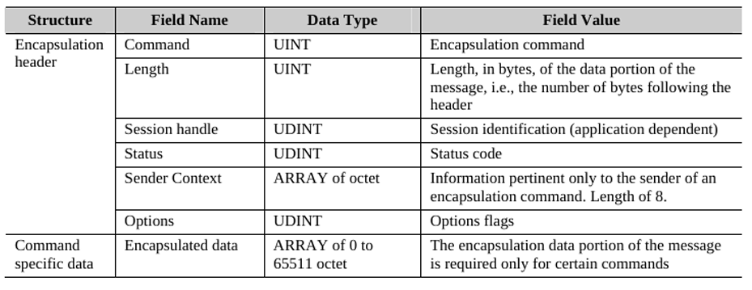

# CIP (Common Industrial Protocol) 
{: .no_toc }

## Table of contents
{: .no_toc .text-delta }

1. TOC
{:toc}

---

### Overview
The Common Industrial Protocol (CIP) is a peer to peer object oriented protocol that provides 
connections between industrial devices (sensors, actuators) and higher-level devices 
(controllers). CIP is physical media and data link layer independent.  See Figure 1-1.1. 

```
Network
└── Device (MACID = 5)
    └── Class (Class ID = 0x01 - Identity)
        └── Instance (Instance ID = 1)
            └── Attribute (Attribute ID = 1 → Vendor ID)
            └── Attribute (Attribute ID = 2 → Device Type)
            └── Attribute (Attribute ID = 3 → Product Code)
            └── Attribute (Attribute ID = 4 → Revision)
        └── Instance (Instance ID = 2)   ← Rare, but possible
    └── Class (Class ID = 0x04 - Assembly)
        └── Instance (Instance ID = 100)
            └── Attribute (Attribute ID = 3 → Input Data)
    └── Class (Class ID = 0x25 - Motor Data)
        └── Instance (Instance ID = 1)
            └── Attribute (Attribute ID = 3 → Run Status)
```

Typesofcommunication
EtherNet/IP offers two maintypesofcommunications: Explicit and Implicit.
Explicit Messaging
• CommunicationProtocol: TCP/IP
• Connection: CanbeConnectedorUnconnected
• Nature: Request/reply transactions, typically for non-real-time data.
• Flexibility: Highly flexible, includes descriptive info, making it less efficient.
• TypicalUse: Reading/Writing configuration information, HMI data collection, etc.
Implicit Messaging
• CommunicationProtocol: UDP/IP
• Connection: AlwaysConnected
• Nature: Real-time I/O data transfers, time-critical.
• Flexibility: Less flexible but more efficient, as little to no descriptive info is included.
• TypicalUse: Real-time control data from remote I/O devices



Encapsulation
• There’snoexplicit information in the headertodistinguish betweenarequestandareply;
it’s determined either implicitly by the command and context or explicitly by the contents of an
encapsulated protocol packet in the data part.
• Fields are transmitted in little-endian byte order.
• Encapsulation messageshaveafixed-lengthheaderof24bytesandanoptionaldataportion.
• Thetotal length of the encapsulation message, including the header, is limited to 65535 bytes.
• Thepacketstructure goes asfollows:


Status field
• TheStatusfieldindicates the success or failure of executing an encapsulation command.
• Azerovalueinareplymeanssuccessfulexecution.
• All requests from the sender shouldhaveaStatusfieldsettozero. ****
• Non-zeroStatus in arequestwill be ignored bythereceiver, and no reply will be generated.


four networks - DeviceNet™, ControlNet™, EtherNet/IP™ and CompoNet™ - use the 
Common Industrial Protocol (CIP) for the upper layers of their network protocol. 

file:///C:/Users/Eric/Desktop/CIP/ilide.info-cip-vol1-3-3-pdf-pr_922db433048f593c4043848877401e27.pdf#page=1231

https://www.odva.org/wp-content/uploads/2020/06/PUB00123R1_Common-Industrial_Protocol_and_Family_of_CIP_Networks.pdf#page=15

### Device Identification


### Reference