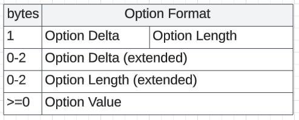

# Constrained Application Protocol
{: .no_toc }

## Table of contents
{: .no_toc .text-delta }

1. TOC
{:toc}

---

### Overview
The Constrained Application Protocol (CoAP) is a lightweight, RESTful protocol designed for resource-constrained devices and networks, such as those commonly found in the Internet of Things (IoT). It operates over UDP to reduce overhead and supports methods similar to HTTP (GET, POST, PUT, DELETE) for interacting with device resources via URI paths. CoAP includes features such as confirmable and non-confirmable message types, multicast support for discovery, and a compact binary format that minimizes data transmission.

CoAP is designed for efficiency and reliability in low-power, lossy networks, making it suitable for smart homes, industrial sensors, and other M2M applications. It supports security through DTLS and OSCORE, and is commonly used as a transport for higher-level management protocols such as LwM2M and TR-369 (USP), enabling scalable and standardized device management in modern broadband and IoT environments.

### CoAP header
[Section 3 - Message Format](https://datatracker.ietf.org/doc/html/rfc7252#section-3)<br>

* Ver : CoAP version
* T : Type Confirmable (0), Non-confirmable (1), Acknowledgement (2), or Reset (3).
* TKL : Length of the variable-length Token field (0-8 bytes). Lengths 9-15 are reserved.
* Code : 3-bit class (MSB) and a 5-bit detail (LSB). The class can indicate a request (0), a success response (2).

* Token : used to correlate requests and responses.
* Message ID: Used to detect message duplication and to match messages of type Acknowledgement/Reset to messages of type Confirmable/Non-confirmable. Function similar to that of sequence number in TCP.
* Options : metadata or control information. 

If a non-empty payload is present, it must be prefixed with a one-byte Payload Marker (0xFF) after the header, token, and options.<br>

<br>
Option 14 is used to extends option value greater than 12. For example, if a CoAP message includes Option 11 (Uri-Path) followed by Option 60 (Size1), the delta is 49—too large for the 4-bit limit (max 12). CoAP sets the delta nibble to 13 and adds one byte with value 36 (13 + 36 = 49).<br>
<br>
Option 14 can be used when the difference between the current and previous CoAP option numbers exceeds 268. This signals that the actual delta is encoded in the next two bytes.

## Python Script
```
import asyncio
import sys
from aiocoap import Context, Message, GET

async def main():
    if len(sys.argv) != 3:
        print("Usage: python3 query_coap.py <ip> <resource-path>")
        print("Example: python3 query_coap.py 192.168.1.10 /.well-known/core")
        print("\nLwM2M Device Info Query Examples:")
        print("  /3/0/0 -> Manufacturer")
        print("  /3/0/1 -> Model number")
        print("  /3/0/3 -> Firmware version")
        sys.exit(1)

    ip = sys.argv[1]
    resource = sys.argv[2].lstrip('/')  # Remove leading slash if present

    # Build full CoAP URI
    uri = f'coap://{ip}/{resource}'

    # Create CoAP client context
    context = await Context.create_client_context()

    # Build GET request
    request = Message(code=GET, uri=uri)

    try:
        # Send request and await response
        response = await context.request(request).response
        print(f"Response from {uri}:\n{response.payload.decode()}")
    except Exception as e:
        print(f"Failed to fetch resource: {e}")

if __name__ == "__main__":
    asyncio.run(main())
```

## Sample Request and Response
Request
```
Constrained Application Protocol, Confirmable, GET, MID:21950
    01.. .... = Version: 1
    ..00 .... = Type: Confirmable (0)
    .... 0010 = Token Length: 2
    Code: GET (1)
    Message ID: 21950
    Token: d043
    Opt Name: #1: Uri-Path: info
        Opt Desc: Type 11, Critical, Unsafe
        1011 .... = Opt Delta: 11
        .... 0100 = Opt Length: 4
        Uri-Path: info
    [Uri-Path: /info]
    [Response In: 2]

0000   42 01 55 be d0 43 b4 69 6e 66 6f                  B.U..C.info                                               .
```
Response
```
Constrained Application Protocol, Acknowledgement, 2.05 Content, MID:21950
    01.. .... = Version: 1
    ..10 .... = Type: Acknowledgement (2)
    .... 0010 = Token Length: 2
    Code: 2.05 Content (69)
    Message ID: 21950
    Token: d043
    Opt Name: #1: Content-Format: text/plain; charset=utf-8
        Opt Desc: Type 12, Elective, Safe
        1100 .... = Opt Delta: 12
        .... 0000 = Opt Length: 0
        Content-type: text/plain; charset=utf-8
    End of options marker: 255
    Payload: Payload Content-Format: text/plain; charset=utf-8, Length: 122
        Payload Desc: text/plain; charset=utf-8
        [Payload Length: 122]
    [Uri-Path: /info]
    [Request In: 1]
    [Response Time: 4.074471882 seconds]

0000   62 45 55 be d0 43 c0 ff 7b 22 63 69 64 22 3a 22   bEU..C..{"cid":"
0010   XX XX XX XX XX XX XX XX 2d XX XX XX XX XX XX XX   XXXXXXXX-XXXX-XX
0020   XX XX 2d XX XX XX XX 2d XX XX XX XX XX XX XX XX   XX-XXXX-XXXXXXXX
0030   XX XX XX XX 22 2c 22 68 74 74 70 5f 70 6f 72 74   XXXX","http_port
0040   22 3a 38 30 2c 22 74 79 70 65 22 3a 22 72 6f 75   ":80,"type":"rou
0050   74 65 72 22 2c 22 6e 61 6d 65 22 3a 22 4b 65 65   ter","name":"Kee
0060   6e 65 74 69 63 20 4f 6d 6e 69 20 44 53 4c 22 2c   netic Omni DSL",
0070   22 76 65 72 73 69 6f 6e 22 3a 22 30 2e 33 2e 35   "version":"0.3.5
0080   22 7d                                             "}                                               .
```

## FOFA search 
```
protocol="coap""query/qlink/queryGwExt"
```

## Reference
[OMA-TS-LightweightM2M_Core-V1_2](https://www.openmobilealliance.org/release/LightweightM2M/V1_2-20201110-A/HTML-Version/OMA-TS-LightweightM2M_Core-V1_2-20201110-A.html)<br>
[Broadband forum - TR-369 Technical Report](https://www.broadband-forum.org/technical-library/?number=TR-369)<br>