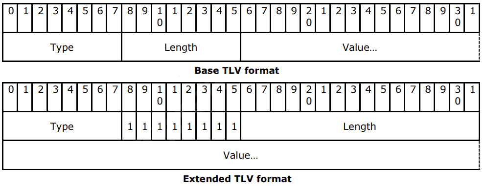
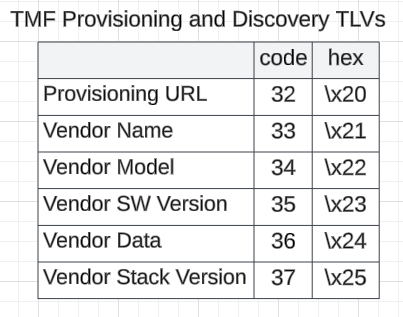

## Table of contents
{: .no_toc .text-delta }

1. TOC
{:toc}

---

### Overview
CoAP TMF (Thread Management Framework) is a component of the Thread protocol that uses CoAP over UDP/IPv6 to manage and commission devices in a mesh network. It operates on port 61631 and defines a set of CoAP URI paths (e.g., /c/mg, /c/ur) for tasks like device discovery, configuration, and diagnostics. TMF payloads often use a TLV (Type-Length-Value) format and enable secure, lightweight communication for managing Thread network topology and device roles.

### CoAP TMF headers
#### Options
According to section 10.4.2.1 Mandatory Options from the Specification, the required options:
* Option (11) - construct the URI Path of a CoAP request. This option appears twice to encode the URI path of the form /x/y.
* Option (12) - when it is <b>explicitly specified</b> in the message definition.
* Option (17) - when it is <b>explicitly specified</b> in the message definition.
* Option (23) [RFC 7959] MUST be supported by a CoAP server when explicitly required in the message definition for the indicated cases. In particular, this option is required for requesting the diagnostic Child Table TLV from a Router that supports a large number of Children (for example, up to 511). For typical Thread Devices, Block2 is not needed.
#### Codes
All CoAP requests used in a TMF message MUST use the POST method

### Payload Format
The default payload format has the CoAP ContentFormat application/octet-stream (42). Payload formatting for TMF is a simple TLV format.


### Device Identification
This section primarily focus on request/response command exposing device info. Specficially focusing on "TMF Provisioning and Discovery TLVs" (section 8.10.3 from Sepcification). These fields help the Joiner verify the correct Commissioner during finalization and assist in Thread network discovery and commissioning.

#### Joiner Finalization Request/Response
```
CoAP Request URI
    coap://[<JR>]:MJ/c/jf
Transaction Pattern
    Req+Rsp_Piggybacked (request part)
CoAP Payload
    State TLV
    Vendor Name TLV
    Vendor Model TLV
    Vendor SW Version TLV
[Vendor Data TLV]
Vendor Stack Version TLV
[Provisioning URL TLV]
```
```
CoAP Response Code
    2.04 Changed
Transaction Pattern
    Req+Rsp_Piggybacked (response part)
CoAP Payload
    State TLV
```

#### Joiner Application Request/Response
```
CoAP Request URI
    coap://[<C>]:MM/c/ja
Transaction Pattern
    Req+Rsp_Piggybacked (request part)
CoAP Payload
    Provisioning URL TLV
    Vendor Name TLV
    Vendor Model TLV
    Vendor SW Version TLV
    [Vendor Data TLV]
    Vendor Stack Version TLV
```
```
CoAP Response Code
    2.04 Changed
Transaction Pattern
    Req+Rsp_Piggybacked (response part)
CoAP Payload
    State TLV
```

#### Get Vendor Data Request
```
CoAP Request URI
    coap://[<TD>]:MM/c/mg
Transaction Pattern
    Req+Rsp_Piggybacked or Req+Rsp_Separate (request part)
CoAP Payload
    Get TLV
```
where Get TLV is list of 8-bit type identifiers, from TMF Provisioning and Discovery TLVs
```
CoAP Response Code
    2.04 Changed
Transaction Pattern
    Req+Rsp_Piggybacked or Req+Rsp_Separate (response part)
CoAP Payload
    Parameter TLVs
```

### Python Script
```
import argparse
import socket
import sys

def build_coap_tmf_request():
    return bytes([
        0x42, 0x02, 0x12, 0x34,             # Header: ver=1, type=0 (CON), tkl=2, code=POST(0.02)
        0x76, 0x70,                         # Token
        0xb1, 0x63, 0x02, 0x6d, 0x67        # '/c/mg'
    ])

def build_coap_post_response():
    return bytes([
        0x62, 0x44, 0x12, 0x34,             # Header: ver=1, type=2 (ACK), Code=2.04
        0x76, 0x70,                         # Token
        0xB1, 0x63,                         # Uri-Path: delta=11, len=1 → 'c'
        0x02, 0x6D, 0x67,                   # Uri-Path: delta=0, len=2 → 'mg'
        0xFF,                               # Payload marker
        0x0D, 0x38,                         # Get TLV (type=13, length=56)
        0x21, 0x0a, *b"Acme Corp1",         # Vendor Name TLV
        0x22, 0x0b, *b"SmartSensor",        # Model Name TLV
        0x23, 0x08, *b"v1.2.3a\x00",        # SW Version TLV
        0x25, 0x07, *b"ACTIVE!",            # Data TLV
        0x26, 0x07, *b"stk-1.4"             # Stack Version TLV
    ])


def run_client(ip, port):
    packet = build_coap_tmf_request()
    sock = socket.socket(socket.AF_INET, socket.SOCK_DGRAM)

    try:
        sock.sendto(packet, (ip, port))
        print(f"Sent CoAP POST /c/mg packet to {ip}:{port}")
        sock.settimeout(5)
        data, addr = sock.recvfrom(1024)
        print(f"Received response from {addr}:")
        print(data.hex())
    except socket.timeout:
        print("No response received within timeout.")
    finally:
        sock.close()

def run_server(port):
    sock = socket.socket(socket.AF_INET, socket.SOCK_DGRAM)
    sock.bind(('', port))
    print(f"Listening on UDP port {port} for incoming CoAP packets...")

    try:
        while True:
            data, addr = sock.recvfrom(4096)
            print(f"Received {len(data)} bytes from {addr}:")
            print(data.hex())

            response = build_coap_post_response()
            sock.sendto(response, addr)
            print(f"Sent CoAP 2.04 Changed response to {addr}")
    except KeyboardInterrupt:
        print("\nServer stopped.")
    finally:
        sock.close()

def main():
    parser = argparse.ArgumentParser(description="Simple raw CoAP client/server")
    group = parser.add_mutually_exclusive_group(required=True)
    group.add_argument('--client', action='store_true', help='Run as CoAP client')
    group.add_argument('--server', action='store_true', help='Run as CoAP server')
    parser.add_argument('--ip', help='IP address of the server (required for client mode)')
    parser.add_argument('--port', type=int, default=5683, help='UDP port (default 5683 for CoAP)')

    args = parser.parse_args()

    if args.client:
        if not args.ip:
            print("Error: --ip is required when using --client")
            sys.exit(1)
        run_client(args.ip, args.port)
    elif args.server:
        run_server(args.port)

if __name__ == "__main__":
    main()
```

## References
[Thread_v1.4.0_Specification.pdf](https://www.threadgroup.org/ThreadSpec)<br>
[The Constrained Application Protocol (CoAP) - RFC7252](https://datatracker.ietf.org/doc/html/rfc7252)<br>
[Uniform Resource Names (URN) Namespaces](https://www.iana.org/assignments/urn-namespaces/urn-namespaces.xhtml)<br>