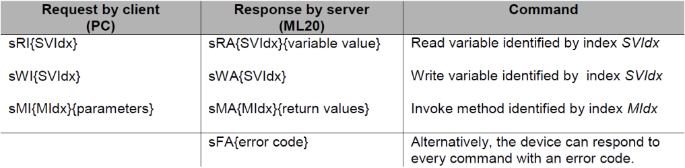
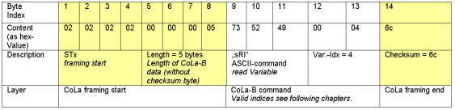
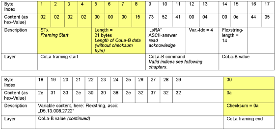
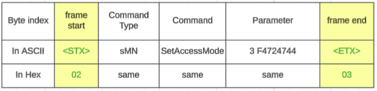
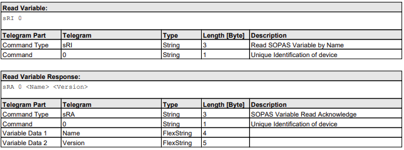

# SICK CoLa-B (Command Language Binary)
{: .no_toc }

## Table of contents
{: .no_toc .text-delta }

1. TOC
{:toc}

---

### Overview
SICK CoLa (Command Language) refers to the family of communication protocols developed by SICK AG for interacting with their industrial sensors, such as LiDAR scanners, safety laser scanners, vision systems, and other detection devices. It operates as part of the SOPAS (SICK Open Protocol for Automation Systems) ecosystem, enabling configuration, parameter access (reading/writing), status monitoring, command execution, and data streaming (e.g., scan or measurement data) over TCP/IP connections. Devices commonly use dedicated ports: CoLa-A on 2111 and CoLa-B on 2112, with newer variants like CoLa-2 on 2122 for enhanced features including better security. CoLa supports event-driven communication and is widely integrated with SICK's SOPAS ET configuration software, which includes terminal tools for testing and debugging telegrams.

The main variants are CoLa-A (ASCII/text-based, human-readable for easy manual interaction and debugging) and CoLa-B (binary format for compact, efficient transmission suited to high-performance or data-intensive tasks). Many SICK devices support one, the other, or both, allowing flexibility based on application needs—CoLa-A simplifies development and troubleshooting, while CoLa-B reduces overhead for faster or bandwidth-constrained scenarios. Newer devices increasingly adopt CoLa-2 (an evolved protocol) for improved capabilities, though CoLa-A and CoLa-B remain broadly deployed in industrial automation for their reliability, compatibility, and mature support across sensor families.

### Protocol Stacks
```
  ------------------------------------
|     Sensor/Host Application        |  <= Client (e.g., PLC, PC, SOPAS ET software)
|------------------------------------|
|          CoLa-B Telegrams          |  <= Binary command/data framing (SOPAS commands)
|------------------------------------|
|               TCP                  |  <= Reliable, connection-oriented transport
|------------------------------------|
|              TCP/IP                |
 ------------------------------------
```

### Cola-B Dataframe

[technical_information_ml20_en_im0059796.pdf#page=8&zoom=100](technical_information_ml20_en_im0059796.pdf#page=8&zoom=100)<br>

#### Request Frame

#### Response Frame


checksum = XOR all bytes 9 to 13

### Cola-A Dataframe

[telegram_listing_nav210_en_im0084703.pdf#page=5&zoom=100,97,700](telegram_listing_nav210_en_im0084703.pdf#page=5&zoom=100,97,700)<br>

There has to be a space in between the command and the parameters and also in between each parameter.<br>
In HEX the command start with 02 and ends with 03. The spaces are marked as 20. Single numbers that are converted to ASCII always get a 3 in front.

below two are the hex and ascii format equivalent
```
<STX>sMN SetAccessMode 3 F4724744<ETX>
02 73 4D 4E 20 53 65 74 41 63 63 65 73 73 4D 6F 64 65 20 33 20 46 34 37 32 34 37 34 34 03
```

### Knwon Command Type/Command

| **Description** | **Value ASCII** | **Value Hex** | **Request/Response** |
|-----------------|-----------------|---------------|----------------------|
| Read by name    | sRN             | 73 52 4E      | request              |
| Write by name   | sWN             | 73 57 4E      | request              |
| Method          | sMN             | 73 4D 4E      | request              |
| Read by name    | sRA             | 73 52 41      | response             |
| Method          | sAN             | 73 41 4E      | response             |

### Telegram Example

DeviceIdent


```
Read Variable:          02 02 02 02 00 00 00 05 73 52 49 00 00 68         ········sRI··h

Read Variable Response: 02 02 02 02 00 00 00 12 73 52 41 00 00 00 04 4D   ········sRA····M
                        4C 32 30 00 05 31 2E 31 31 30 4D                  L20··1.110M
```

## Reference
[SOPAS Communication Interface Description.zip](http://ericwu1997.github.io/docs/protocol-analysis/transport-layer/cola-b/SOPAS_Communication_Interface_Description.zip)<br>