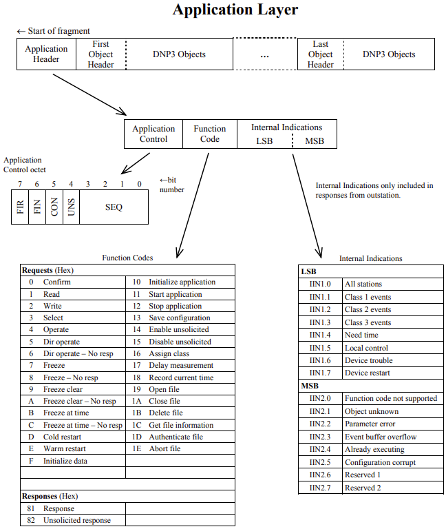
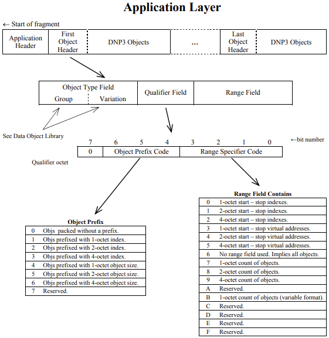

# Distributed Network Protocol 3
{: .no_toc }

## Table of contents
{: .no_toc .text-delta }

1. TOC
{:toc}

---

### Overview
DNP3 (Distributed Network Protocol) is a vendor-neutral protocol used in SCADA and electric utility systems for communication between control centers (masters) and field devices (outstations). It typically runs over serial links or TCP/IP (commonly port 20000) and supports reading data, reporting events, and issuing control commands. DNP3 is designed for reliability in noisy environments and includes features like event-based reporting, time-stamping, and optional secure authentication for improved security and integrity.

### Protocol Strucutre

[reference](https://cdn.chipkin.com/assets/uploads/imports/resources/DNP3Introduction-Draft_G.pdf#page=28&zoom=100)<br>



### DNP3 SA

#### Security Function Code

| Function Code | Name                               | Descirption          |
|---------------|------------------------------------|----------------------|
| 0x20          | Authentication Request             | Master -> Outstation |
| 0x21          | Autheitication Requestion - No Ack | Master -> Outstation |
| 0x83          | Authenticaiton Response            | Outstation > Master  |

#### Basic Authentication Object

| Group | Var | Hex    | Name                       | Transmitted by |
|-------|-----|--------|----------------------------|----------------|
| 120   | 1   | 0x7801 | Challenge                  | Either         |
| 120   | 2   | 0x7802 | Reply                      | Either         |
| 120   | 3   | 0x7803 | Aggressive Mode Request    | Either         |
| 120   | 4   | 0x7804 | Session Key Status Request | Master         |
| 120   | 5   | 0x7805 | Session Key Status         | Outstation     |
| 120   | 6   | 0x7806 | Session Key Change         | Master         |
| 120   | 7   | 0x7807 | Error                      | Either         |
| 120   | 9   | 0x7809 | MAC                        | Either         |

#### Update Key Change Objects

| Group | Var | Hex    | Name                            | Transmitted by |
|-------|-----|--------|---------------------------------|----------------|
| 120   | 8   | 0x7808 | User Certificate **             | Master         |
| 120   | 10  | 0x780A | User Status Change              | Master         |
| 120   | 11  | 0x780B | Update Key Change Request       | Master         |
| 120   | 12  | 0x780C | Update Key Change Reply         | Outstation     |
| 120   | 13  | 0x780D | Update Key Change               | Master         |
| 120   | 14  | 0x780E | Update Key Change Signature **  | Master         |
| 120   | 15  | 0x780F | Update Key Change Confirmation  | Either         |

### Device Attributes Group 0 - Device Identification

| Group | Var | Hex    | Name                            | Transmitted by |
|-------|-----|--------|---------------------------------|----------------|
| 0     | 250 | 0x00FA | Device Product name & Model     | Outstation     |
| 0     | 252 | 0x00FC | Manufacturers Name              | Outstation     |
| 0     | 242 | 0x00F2 | Manufacturers Software Version  | Outstation     |
| 0     | 243 | 0x00F3 | Manufacturers Serial Number     | Outstation     |
| 0     | 248 | 0x00F8 | Manufacturers Hardware Version  | Outstation     |

## Wireshark dissector tree view & Hex dump

Function Code: Authentication Request (0x20)<br>
Authentication Session Key Status Request (Obj:120, Var:04) (0x7804)<br>

```
Distributed Network Protocol 3.0
    Data Link Layer, Len: 14, From: 3, To: 4, DIR, PRM, Unconfirmed User Data
        Start Bytes: 0x0564
        Length: 14
        Control: 0xc4 (DIR, PRM, Unconfirmed User Data)
        Destination: 4
        Source: 3
        Data Link Header checksum: 0xd36d [correct]
        [Data Link Header Checksum Status: Good]
    Transport Control: 0xc0, Final, First(FIR, FIN, Sequence 0)
    Data Chunks
    [1 DNP 3.0 AL Fragment (8 bytes): #4(8)]
    Application Layer: (FIR, FIN, Sequence 1, Authentication Request)
        Application Control: 0xc1, First, Final(FIR, FIN, Sequence 1)
        Function Code: Authentication Request (0x20)
        Authentication Request Data Objects
            Object(s): Authentication Session Key Status Request (Obj:120, Var:04) (0x7804), 1 point
                Qualifier Field, Prefix: None, Range: 8-bit Single Field Quantity
                Number of Items: 1
                Point Number 0
                User Number: 1


0000   05 64 0e c4 04 00 03 00 6d d3 c0 c1 20 78 04 07   .d......m... x..
0010   01 01 00 9e 40   
```

## Reference 
[DNP3 Specification Volumn 1](https://cdn.chipkin.com/assets/uploads/imports/resources/DNP3Introduction-Draft_G.pdf)<br>
[Wireshark DNP3 Dissector](https://fossies.org/linux/wireshark/epan/dissectors/packet-dnp.c)<br>
[Youtube - DNP3 SA 3 Intermediate](https://www.youtube.com/watch?v=RfHsrDwzpS0&list=RD6ca_YHZvzls&index=29)<br>
[Siemens - DNP3 Specificiaton](https://cache.industry.siemens.com/dl/files/310/109759310/att_989900/v1/SIMATIC_RTU3031C_DNP3_Device_Profile_V3.1.pdf)<br>