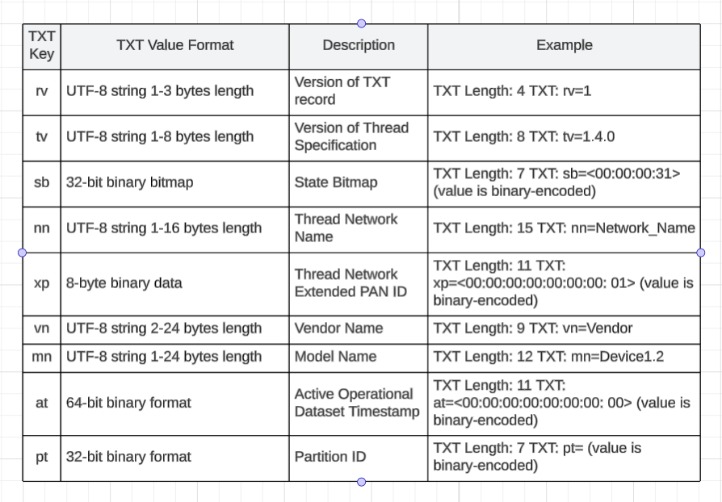
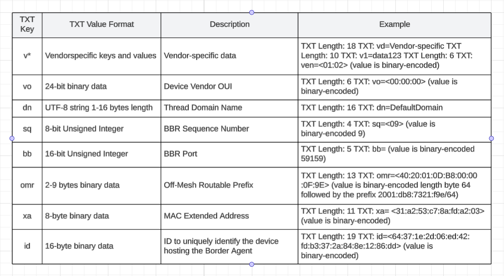

## Table of contents
{: .no_toc .text-delta }

1. TOC
{:toc}

---

### meshcop
Devices implementing Thread commissioning Border Agents with external network interfaces (e.g., Ethernet or Wi-Fi) must advertise their commissioning services using DNS Service Discovery (DNS-SD) with the service type _meshcop._udp.local.. The advertised service instance name should be human-readable and follow the format “VendorName ProductName”. 

### DNS-SD TXT Answer Record Key-Value Pair Format



### dig discovery / TXT Record Answer
```
dig _meshcop._udp.local PTR @10.0.0.1 -p 5353
``` 
```
Google Nest Hub (154f)._meshcop._udp.local: type TXT, class IN, cache flush
    Name: Google Nest Hub (154f)._meshcop._udp.local
    Type: TXT (16) (Text strings)
    .000 0000 0000 0001 = Class: IN (0x0001)
    1... .... .... .... = Cache flush: True
    Time to live: 4500 (1 hour, 15 minutes)
    Data length: 234
    TXT Length: 36
    TXT: vcd=XXXXXXXXXXXXXXXXXXXXXXXXXXXXXXXX
    TXT Length: 19
    TXT: id=�h�����\n��(�n�`B
    TXT Length: 6
    TXT: vo=|�\ (7C:D9:5C, Google OUI)
    TXT Length: 10
    TXT: vvo=7CD95C
    TXT Length: 20
    TXT: vxp=XXXXXXXXXXXXXXXX
    TXT Length: 20
    TXT: vat=XXXXXXXXXXXXXXXX
    TXT Length: 4
    TXT: rv=1
    TXT Length: 8
    TXT: tv=1.3.0
    TXT Length: 7
    TXT: sb=
    TXT Length: 16
    TXT: nn=NEST-PAN-EA0C
    TXT Length: 11
    TXT: xp=2�\x1Cw�ש�
    TXT Length: 14
    TXT: vn=Google Inc.
    TXT Length: 18
    TXT: mn=Google Nest Hub
    TXT Length: 11
    TXT: xa=�C04��\x15O
    TXT Length: 11
    TXT: at=XXXXXXXXXX
    TXT Length: 7
    TXT: pt=?\x13K�
```
```
0000   c0 2b 00 10 80 01 00 00 11 94 00 ea 24 76 63 64   .+..........$vcd
0010   3d XX XX XX XX XX XX XX XX XX XX XX XX XX XX XX   =XXXXXXXXXXXXXXX
0020   XX XX XX XX XX XX XX XX XX XX XX XX XX XX XX XX   XXXXXXXXXXXXXXXX
0030   32 13 69 64 3d XX XX XX XX XX XX XX XX XX XX XX   X.id=XXXXXXXXXXX
0040   XX XX XX XX XX XX 76 6f 3d 7c d9 5c 0a 76 76 6f   XXXXXXvo=|.\.vvo
0050   3d 37 43 44 39 35 43 14 76 78 70 3d XX XX XX XX   =7CD95C.vxp=XXXX
0060   XX XX XX XX XX XX XX XX XX XX XX XX 14 76 61 74   XXXXXXXXXXXX.vat
0070   3d XX XX XX XX XX XX XX XX XX XX XX XX XX XX XX   =XXXXXXXXXXXXXXX
0080   XX 04 72 76 3d 31 08 74 76 3d 31 2e 33 2e 30 07   X.rv=1.tv=1.3.0.
0090   73 62 3d XX XX XX XX XX 6e 6e 3d 4e 45 53 54 2d   sb=XXXXXnn=NEST-
00a0   50 41 4e 2d 45 41 30 43 0b 78 70 3d XX XX XX XX   PAN-EA0C.xp=XXXX
00b0   XX XX XX XX XX 76 6e 3d 47 6f 6f 67 6c 65 20 49   XXXXXvn=Google I
00c0   6e 63 2e 12 6d 6e 3d 47 6f 6f 67 6c 65 20 4e 65   nc..mn=Google Ne
00d0   73 74 20 48 75 62 0b 78 61 3d XX XX XX XX XX XX   st Hub.xa=XXXXXX
00e0   XX XX XX 61 74 3d XX XX XX XX XX XX XX XX XX XX   XXXat=XXXXXXXXXX
00f0   74 3d XX XX XX XX                                 t=XXXX
```

### References
[Service Name and Transport Protocol Port Number Registry](https://www.iana.org/assignments/service-names-port-numbers/service-names-port-numbers.xhtml?search=https#:~:text=meshcop)<br>
[Thread 1.1 Specification, Section 8.4.1.1.2. https://www.threadgroup.org/ThreadSpec]()<br>