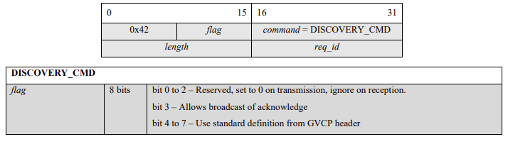
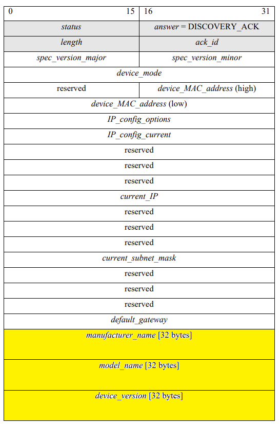

# GVCP (GigE Vision Control Protocol)
{: .no_toc }

## Table of contents
{: .no_toc .text-delta }

1. TOC
{:toc}

---

### Overview
GVCP (GigE Vision Control Protocol) is a UDP-based protocol used to discover and control GigE Vision cameras over Ethernet, typically on port 3956. Developed by the Automated Imaging Association (AIA), it enables tasks like device discovery, IP configuration, and register access in machine vision systems.

## DISCOVERY_CMD

```
struct gvcp_cmd_header{
	uint8 cMsgKeyCode; // 0x42
	uint8 cFlag;       // 0x11 allow broadcast ack;ack required
	uint16 wCmd;       // discovery_cmd=2;FORCEIP_CMD = 4;READREG_CMD=0x80
	uint16 wLen;       // payload length
	uint16 wReqID;     // request id = 1;READREG id=12345
};
```

## DISCOVERY_ACK

```
struct gvcp_ack_header{
	uint16 wStatus; //success=0;
	uint16 wAck;    //discover_ack=3;forceip_ack=5;READREG_ACK=0x81
	uint16 wLen;
	uint16 wReqID;
};

struct gvcp_ack_payload{
	uint32 dwSpecVer;
	uint32 dwDevMode;
	uint8 Mac[8];         //last 6 byte
	uint32 dwSupIpSet;
	uint32 dwCurIpSet;
	//uint8 unused1[12];
	uint8 CurIP[16];      //last 4 byte
	uint8 SubMask[16];    //last 4 byte
	uint8 Gateway[16];    //last 4 byte
	char szFacName[32];   //first
	char szModelName[32]; //first
	char szDevVer[32];
	char szFacInfo[48];
	char szSerial[16];
	char szUserName[16];
};
```

## Hex dump
Simulated response
```
GigE Vision Control Protocol
    Acknowledge Header: DISCOVERY_ACK
        Status: GEV_STATUS_SUCCESS (0x0000)
        Acknowledge: DISCOVERY_ACK (0x0003)
        Payload Length: 0x00f8 (248)
        Request ID: 0x0001 (1)
        [Request In: 1]
        DISCOVERY_ACK Payload
            Spec Version: 0x01000100
            Device Mode: 0x00000001
            Device MAC Address: 2b:3c:4d:5e:00:00 (2b:3c:4d:5e:00:00)
            Supported IP Configuration: 0x00000007
            Current IP Configuration: 0x00000001
            Current IP: 192.168.1.100
            Subnet Mask: 255.255.255.0
            Default Gateway: 192.168.1.1
            Manufacturer Name: MyCompany
            Model Name: GVCPDevice
            Device Version: v1.0
            Manufacturer Specific Info: Manufactured by MyCompany Inc.
            Serial Number: SN12345678
            User-defined Name: admin
```
```
0000   00 00 00 03 00 f8 00 01 01 00 01 00 00 00 00 01   ................
0010   00 1a 2b 3c 4d 5e 00 00 00 00 00 07 00 00 00 01   ..+<M^..........
0020   00 00 00 00 00 00 00 00 00 00 00 00 c0 a8 01 64   ...............d
0030   00 00 00 00 00 00 00 00 00 00 00 00 ff ff ff 00   ................
0040   00 00 00 00 00 00 00 00 00 00 00 00 c0 a8 01 01   ................
0050   4d 79 43 6f 6d 70 61 6e 79 00 00 00 00 00 00 00   MyCompany.......
0060   00 00 00 00 00 00 00 00 00 00 00 00 00 00 00 00   ................
0070   47 56 43 50 44 65 76 69 63 65 00 00 00 00 00 00   GVCPDevice......
0080   00 00 00 00 00 00 00 00 00 00 00 00 00 00 00 00   ................
0090   76 31 2e 30 00 00 00 00 00 00 00 00 00 00 00 00   v1.0............
00a0   00 00 00 00 00 00 00 00 00 00 00 00 00 00 00 00   ................
00b0   4d 61 6e 75 66 61 63 74 75 72 65 64 20 62 79 20   Manufactured by 
00c0   4d 79 43 6f 6d 70 61 6e 79 20 49 6e 63 2e 00 00   MyCompany Inc...
00d0   00 00 00 00 00 00 00 00 00 00 00 00 00 00 00 00   ................
00e0   53 4e 31 32 33 34 35 36 37 38 00 00 00 00 00 00   SN12345678......
00f0   61 64 6d 69 6e 00 00 00 00 00 00 00 00 00 00 00   admin...........
```

Real response
```
GigE Vision Control Protocol
    Acknowledge Header: DISCOVERY_ACK
        Status: GEV_STATUS_SUCCESS (0x0000)
        Acknowledge: DISCOVERY_ACK (0x0003)
        Payload Length: 0x00f8 (248)
        Request ID: 0x0001 (1)
        DISCOVERY_ACK Payload
            Spec Version: 0x00020001
            Device Mode: 0x80000001
            Device MAC Address: Keyence_XX:XX:XX (XX:XX:XX:XX:XX:XX)
            Supported IP Configuration: 0x00000007
            Current IP Configuration: 0x00000007
            Current IP: 10.9.2.29
            Subnet Mask: 255.255.255.0
            Default Gateway: 10.9.2.254
            Manufacturer Name: KEYENCE CORPORATION
            Model Name: VS-L500MX
            Device Version: 1.5.0004
            Manufacturer Specific Info: 
            Serial Number: XXXXXXXXXX
            User-defined Name: M202OP110_Split
```
```
0000   00 00 00 03 00 f8 00 01 00 02 00 01 80 00 00 01   ................
0010   00 00 XX XX XX XX XX XX 00 00 00 07 00 00 00 07   ......r.........
0020   00 00 00 00 00 00 00 00 00 00 00 00 0a 09 02 1d   ................
0030   00 00 00 00 00 00 00 00 00 00 00 00 ff ff ff 00   ................
0040   00 00 00 00 00 00 00 00 00 00 00 00 0a 09 02 fe   ................
0050   4b 45 59 45 4e 43 45 20 43 4f 52 50 4f 52 41 54   KEYENCE CORPORAT
0060   49 4f 4e 00 00 00 00 00 00 00 00 00 00 00 00 00   ION.............
0070   56 53 2d 4c 35 30 30 4d 58 00 00 00 00 00 00 00   VS-L500MX.......
0080   00 00 00 00 00 00 00 00 00 00 00 00 00 00 00 00   ................
0090   31 2e 35 2e 30 30 30 34 00 00 00 00 00 00 00 00   1.5.0004........
00a0   00 00 00 00 00 00 00 00 00 00 00 00 00 00 00 00   ................
00b0   00 00 00 00 00 00 00 00 00 00 00 00 00 00 00 00   ................
00c0   00 00 00 00 00 00 00 00 00 00 00 00 00 00 00 00   ................
00d0   00 00 00 00 00 00 00 00 00 00 00 00 00 00 00 00   ................
00e0   XX XX XX XX XX XX XX XX XX XX 00 00 00 00 00 00   XXXXXXXXXX......
00f0   4d 32 30 32 4f 50 31 31 30 5f 53 70 6c 69 74 00   M202OP110_Split.
```

## Python server/client implementation
```
python3 gvcp_client_server.py --server
```
```
python3 gvcp_client_server.py --client --ip 127.0.0.1
```
```
import socket
import struct
import argparse

GVCP_DISCOVERY_CMD = 0x0002
GVCP_DISCOVERY_ACK = 0x0003

def build_gvcp_ack(req_id):
    # Header
    wStatus = 0
    wAck = GVCP_DISCOVERY_ACK
    wLen = 0  # will be calculated after payload
    wReqID = req_id

    # Payload mock values
    dwSpecVer = 0x01000100
    dwDevMode = 0x00000001
    mac = bytes([0x00, 0x1A, 0x2B, 0x3C, 0x4D, 0x5E]) + bytes([0, 0])  # 8 bytes
    dwSupIpSet = 0x00000007
    dwCurIpSet = 0x00000001

    def padded_ip(ip):
        b = socket.inet_aton(ip)
        return b.rjust(16, b'\x00')

    CurIP = padded_ip("192.168.1.100")
    SubMask = padded_ip("255.255.255.0")
    Gateway = padded_ip("192.168.1.1")

    def padded_str(s, size):
        return s.encode('ascii').ljust(size, b'\x00')

    szFacName = padded_str("MyCompany", 32)
    szModelName = padded_str("GVCPDevice", 32)
    szDevVer = padded_str("v1.0", 32)
    szFacInfo = padded_str("Manufactured by MyCompany Inc.", 48)
    szSerial = padded_str("SN12345678", 16)
    szUserName = padded_str("admin", 16)

    payload = struct.pack(
        "!II8sII16s16s16s32s32s32s48s16s16s",
        dwSpecVer,
        dwDevMode,
        mac,
        dwSupIpSet,
        dwCurIpSet,
        CurIP,
        SubMask,
        Gateway,
        szFacName,
        szModelName,
        szDevVer,
        szFacInfo,
        szSerial,
        szUserName
    )

    wLen = len(payload)
    header = struct.pack("!HHHH", wStatus, wAck, wLen, wReqID)
    return header + payload

def run_server(listen_port):
    sock = socket.socket(socket.AF_INET, socket.SOCK_DGRAM)
    sock.bind(("", listen_port))
    print(f"Server listening on UDP port {listen_port}")

    while True:
        data, addr = sock.recvfrom(1024)
        print(f"\nReceived {len(data)} bytes from {addr}")
        print("Raw data:", data.hex())

        if len(data) >= 8:
            cMsgKeyCode, cFlag, wCmd, wLen, wReqID = struct.unpack("!BBHHH", data[:8])
            print("GVCP Header:")
            print(f"  MsgKeyCode: 0x{cMsgKeyCode:02X}")
            print(f"  Flag:       0x{cFlag:02X}")
            print(f"  Cmd:        0x{wCmd:04X}")
            print(f"  Length:     {wLen}")
            print(f"  ReqID:      {wReqID}")

            if wCmd == GVCP_DISCOVERY_CMD:
                print(">> Discovery command received. Sending ACK.")
                response = build_gvcp_ack(wReqID)
                sock.sendto(response, addr)
                print(">> ACK sent.\n")

def send_gvcp_discovery(target_ip, target_port):
    cMsgKeyCode = 0x42
    cFlag = 0x11
    wCmd = GVCP_DISCOVERY_CMD
    wLen = 0
    wReqID = 1
    packet = struct.pack("!BBHHH", cMsgKeyCode, cFlag, wCmd, wLen, wReqID)

    sock = socket.socket(socket.AF_INET, socket.SOCK_DGRAM)
    sock.setsockopt(socket.SOL_SOCKET, socket.SO_BROADCAST, 1)
    sock.settimeout(2.0)

    sock.sendto(packet, (target_ip, target_port))
    print(f"Sent GVCP Discovery to {target_ip}:{target_port}")

    try:
        data, addr = sock.recvfrom(2048)
        print(f"\nReceived response from {addr}")
        print(data.hex())
    except socket.timeout:
        print("No response received (timeout)")

    sock.close()

if __name__ == "__main__":
    parser = argparse.ArgumentParser()
    mode = parser.add_mutually_exclusive_group(required=True)
    mode.add_argument("--client", action="store_true", help="Run as GVCP client")
    mode.add_argument("--server", action="store_true", help="Run as GVCP server")
    parser.add_argument("--ip", help="Target IP address (required for client)")
    parser.add_argument("--port", type=int, default=3956, help="Port to listen or send")

    args = parser.parse_args()

    if args.client:
        if not args.ip:
            print("Error: --ip is required in client mode")
        else:
            send_gvcp_discovery(args.ip, args.port)
    elif args.server:
        run_server(args.port)

```

## Reference 
[GigE Vision Specification](https://6576084.fs1.hubspotusercontent-na1.net/hubfs/6576084/Vision%20Standards/GigE-Vision-Specification_2-2-00.pdf)<br>
[https://github.com/BigSensor/GvcpServer/tree/main](https://github.com/BigSensor/GvcpServer/tree/main)<br>
[GVCP Wireshark Dissector](https://github.com/wireshark/wireshark/blob/master/epan/dissectors/packet-gvcp.c)<br>