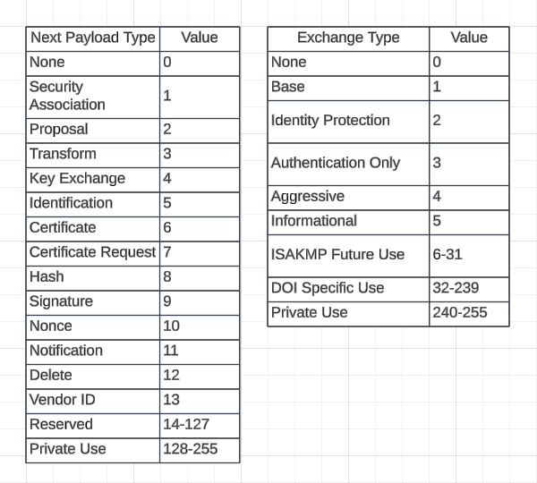
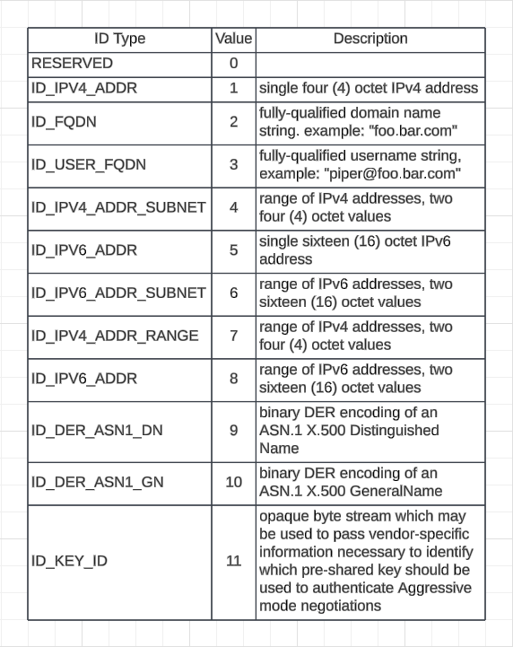
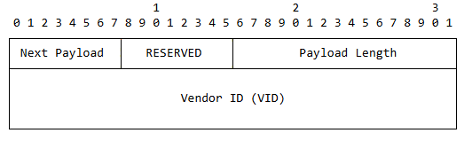
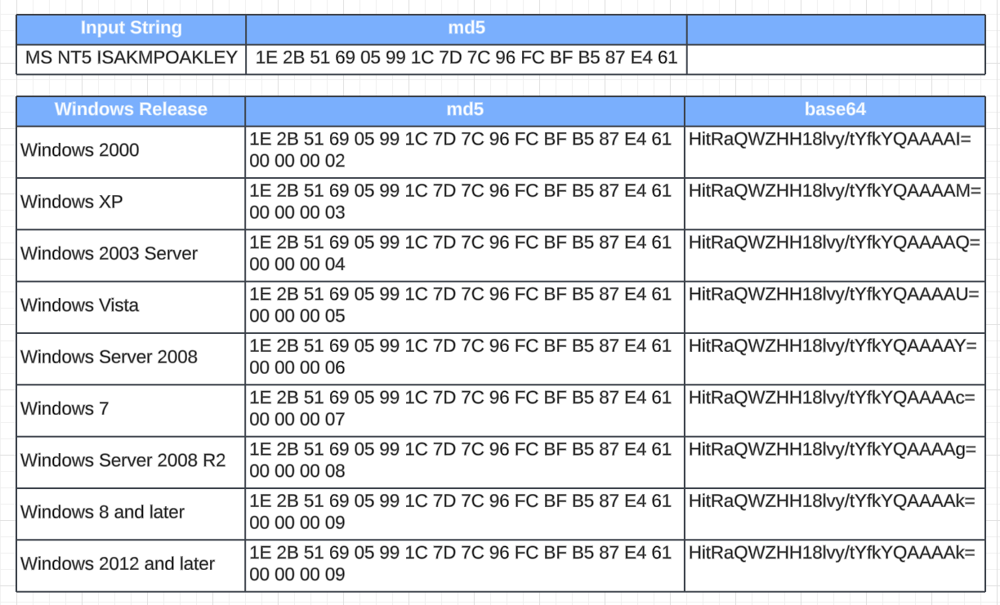
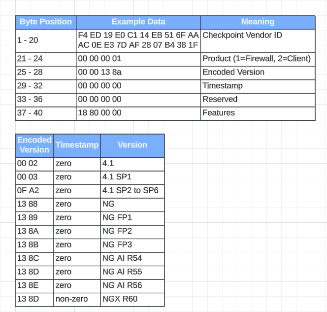

# ISAKMP (Internet Security Association and Key Management Protocol)
{: .no_toc }

## Table of contents
{: .no_toc .text-delta }

1. TOC
{:toc}

---

### Overview
ISAKMP (Internet Security Association and Key Management Protocol) is a protocol used to establish, negotiate, modify, and delete security associations (SAs) in IPsec. It operates independently of the encryption and authentication algorithms used and provides a framework for key exchange and management. ISAKMP typically works with IKE (Internet Key Exchange) to automate the process of setting up secure IP communications.<br>
<br>
ISAKMP typically uses UDP port 500 for standard Internet Key Exchange (IKE) communications to establish security associations in IPsec. When Network Address Translation (NAT) is involved, ISAKMP switches to UDP port 4500 using NAT Traversal (NAT-T), which encapsulates IKE and IPsec packets in UDP to maintain connectivity across NAT devices.

### Header Format & Types 
 
 

### Identification Payload
 


### Vendor ID Payload

Vendor ID - Hash of the vendor string plus version.

### nmap script
```
┌──(root㉿kali)-[/home/kali]
└─# nmap -sU -p 500 --script ike-version 10.0.0.1
Starting Nmap 7.92 ( https://nmap.org ) at 2025-07-23 13:46 EDT
Nmap scan report for 10.0.0.1
Host is up (0.25s latency).

PORT    STATE SERVICE
500/udp open  isakmp
| ike-version: 
|   vendor_id: Microsoft Windows 2000
|   attributes: 
|     MS NT5 ISAKMPOAKLEY
|     IKE FRAGMENTATION
|_    draft-ietf-ipsec-nat-t-ike-02\n
Service Info: OS: Windows 2000; CPE: cpe:/o:microsoft:windows:2000, cpe:/o:microsoft:windows
```

### Known Vendor ID
#### Windows
The Microsoft implementation vendor ID is constructed by appending a 4-byte version number in network byte order to the 16-byte MD5 hash of the "MS NT5 ISAKMPOAKLEY" string. The version number is the additional 4 bytes that denote the Windows release. [reference](https://learn.microsoft.com/en-us/openspecs/windows_protocols/ms-ikee/74df968a-7125-431d-9c98-4ea929e548dc?redirectedfrom=MSDN#:~:text=Wire%20representation%20%28MD5%20hash%20of%20string%29)<br>

```
# Wireshark Tree view
Payload: Vendor ID (13) : MS NT5 ISAKMPOAKLEY
    Next payload: Vendor ID (13)
    Reserved: 00
    Payload length: 24
    Vendor ID: 1e2b516905991c7d7c96fcbfb587e46100000002
    Vendor ID: MS NT5 ISAKMPOAKLEY
    MS NT5 ISAKMPOAKLEY: Windows 2000 (2)

0000   0d 00 00 18 1e 2b 51 69 05 99 1c 7d 7c 96 fc bf
0010   b5 87 e4 61 00 00 00 02
```

#### Checkpoint Firewall
This CheckPoint VID is 40 bytes in length. The first 20 bytes are always the same, and the last 20 bytes contain details about the version and configuration.
The 2nd 20 bytes (bytes 21 to 40) of the Vendor ID payload consist of five 4-byte integers in network (big endian) byte order. The 4-byte integer at byte positions 25 to 28 inclusive contains the Firewall-1 version number. [reference](https://www.royhills.co.uk/wiki/index.php/Check_Point_Firewall-1#Vendor_IDs)

```
# Wireshark Tree view
Payload: Vendor ID (13) : CryptoPro/GOST 0.1 / Check Point R65
    Next payload: NONE / No Next Payload (0)
    Reserved: 00
    Payload length: 44
    Vendor ID: f4ed19e0c114eb516faaac0ee37daf2807b4381f000000010000138d68826f6a0000000018280000
    Vendor ID: CryptoPro/GOST 0.1 / Check Point R65
    Checkpoint Product: Firewall-1 (1)
    Checkpoint Version: NG with Application Intelligence R55 (5005)
    Checkpoint Timestamp: 1753378666
    Checkpoint Reserved: 0x00000000
    Checkpoint Features: 0x18280000

0000   00 00 00 2c f4 ed 19 e0 c1 14 eb 51 6f aa ac 0e   ...,.......Qo...
0010   e3 7d af 28 07 b4 38 1f 00 00 00 01 00 00 13 8d   .}.(..8.........
0020   68 82 6f 6a 00 00 00 00 18 28 00 00               h.oj.....(..
```

```
Dead Peer Detection - "AF CA D7 13 68 A1 F1 C9 6B 86 96 FC 77 57 01 00" - "r8rXE2ih8clrhpb8d1cBAA==" - md5("CISCO-DEAD-PEER-DETECTION")
Cisco Unity - "12 F5 F2 8C 45 71 68 A9 70 2D 9F E2 74 CC 01 00" - "EvXyjEVxaKlwLZ/idMwBAA==" - md5("CISCO-UNITY")
Netgear - "DB FB 81 EB 57 60 B0 78 85 62 06 7D A1 02 D7 55" - "2/uB61dgsHiFYgZ9oQLXVQ==" - md5("NETGEAR")
SonicWall-6 - "5B 36 2B C8 20 F6 00 06" - "WzYryCD2AAY=" - md5("")
SonicWall-7 - "5B 36 2B C8 20 F6 00 07" - "WzYryCD2AAc=" - md5("")
SonicWall-8 - "5B 36 2B C8 20 F6 00 08" - "WzYryCD2AAg=" - md5("")
SonicWall-b - "DA 8E 93 78 80 01 00 00" - "2o6TeIABAAA=" - md5("")
SonicWall-c - "5B 36 2B C8 20 F7 00 01" - "WzYryCD3AAE=" - md4("")

ZyXEL - "62 50 27 74 9D 5A B9 7F 56 16 C1 60 27 65 CF 48 0A 3B 7D 0B" - "YlAndJ1auX9WFsFgJ2XPSAo7fQs="
ZyXEL ZyWALL USG 100 - "F7 58 F2 26 68 75 0F 03 B0 8D F6 EB E1 D0" - "91jyJmh1DwOwjfbr4dA="

NetScreenOS - "16 6F 93 2D 55 EB 64 D8 E4 DF 4F D3 7E 23 13 F0 D0 FD 84 51 00 00 00 00 00 00 00 00" - "Fm+TLVXrZNjk30/TfiMT8ND9hFEAAAAAAAAAAA=="
            - "4A 43 40 B5 43 E0 2B 84 C8 8A 8B 96 A8 AF 9E BE 77 D9 AC CC 00 00 00 0B 00 00 05 00" - "SkNAtUPgK4TIiouWqK+evnfZrMwAAAALAAAFAA=="

Fortinet Fortigate - "82 99 03 17 57 A3 60 82 C6 A6 21 DE 00 05 04 28" - "gpkDF1ejYILGpiHeAAUEKA==" - md5("FORTIGATE")
                   - "1D 6E 17 8F 6C 2C 0B E2 84 98 54 65 45 0F E9 D4" - "HW4Xj2wsC+KEmFRlRQ/p1A=="

Checkpoint - "F4 ED 19 E0 C1 14 EB 51 6F AA AC 0E E3 7D AF 28 07 B4 38 1F" - "9O0Z4MEU61FvqqwO432vKAe0OB8"

Cisco Unity - "12 F5 F2 8C 45 71 68 A9 70 2D 9F E2 74 CC"
Cisco Concentrator - "1F 07 F7 0E AA 65 14 D3 B0 FA 96 54 2A 50 01 00"
```

## Reference 
[Wireshark ISAKMP Dissector Github](https://github.com/wireshark/wireshark/blob/master/epan/dissectors/packet-isakmp.c)<br>
[RFC2408 - 3.1 ISAKMP Header Format](https://www.ietf.org/rfc/rfc2408.txt#:~:text=3.1%20isakmp%20header%20format%0a)<br>
[RFC2407 - 4.6.2 Identification Payload Content](https://datatracker.ietf.org/doc/html/rfc2407#section-4.6.2)<br>
[RFC2407 - 4.6.2.1 Identification Type Values](https://datatracker.ietf.org/doc/html/rfc2407#section-4.6.2.1)<br>
[RFC2408 - 3.16 Vendor ID Payload](https://datatracker.ietf.org/doc/html/rfc2408#section-3.16)<br>
[IKE Scan](https://github.com/royhills/ike-scan/blob/master/ike-vendor-ids)<br>