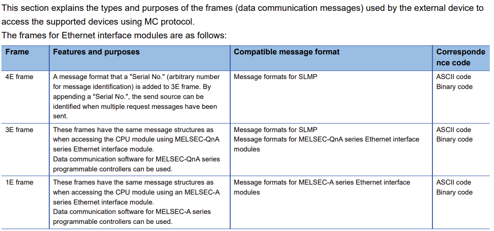
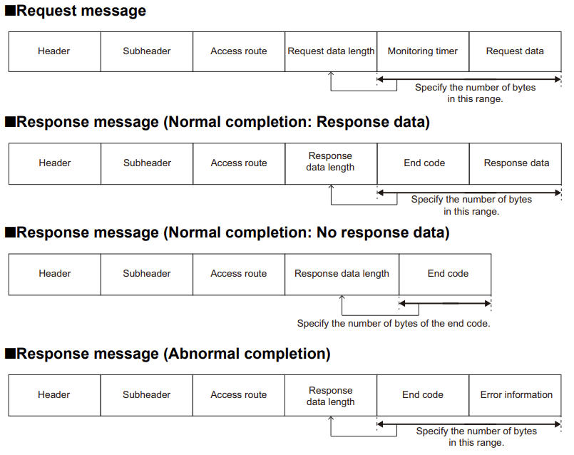

# MELSEC
{: .no_toc }

## Table of contents
{: .no_toc .text-delta }

1. TOC
{:toc}

---

### Overview

### Frames

### Message Format

#### Subheader

4E frame - Request message (serial No. '1234')

| * all in hex | Fixed Value | SN          | Free        |
|:-------------|:------------|:------------|:------------|
| ASCII  mode  | 35 34 30 30 | 31 32 33 34 | 30 30 30 30 |
| Binary mode  | 54 00       | 34 12       | 00 00       |

3E frame - Request message

| * all in hex | Fixed Value |
|:-------------|:------------|
| ASCII  mode  | 35 30 30 30 |
| Binary mode  | 50 00       |

Response message

| * all in hex | Fixed Value |
|:-------------|:------------|
| ASCII  mode  | 44 30 30 30 |
| Binary mode  | D0 00       |

#### Access Route

4E, 3E

| * all in hex | Network No. | PC No. | Req Dst Module I/O No. | Req Dst Module Station No. |
|:-------------|:------------|:-------|:-----------------------|:---------------------------|
| ASCII  mode  | 30 30       | 46 46  | 30 33 46 46            | 30 30                      |
| Binary mode  | 00          | FF     | FF 03                  | 00                         |

#### Commands and Functions

The value of command is specified at the head of a request data.  

4C/3C/4E/3E frame

## Reference 

[IPESOFT - Mitsubishi MELSEC protocol](https://doc.ipesoft.com/display/D2DOCV26EN/Mitsubishi+MELSEC+protocol) 
[nmap - melsecq-discover.nse](https://github.com/cckuailong/ICS-Protocal-Detect-Nmap-Script/blob/master/melsecq-discover.nse) 
[SLMP reference Manual](https://dl.mitsubishielectric.com/dl/fa/document/manual/plc/sh080956eng/sh080956engl.pdf) 
[MELSEC Communication Protocol Reference Manual](https://dl.mitsubishielectric.com/dl/fa/document/manual/plc/sh080008/sh080008ab.pdf) 
[Github - blackhat23-melsoft](https://github.com/NozomiNetworks/blackhat23-melsoft) 
[Github - mitsubishi-wireshark-plugin](https://github.com/Masamuneee/mitsubishi-wireshark-plugin) 